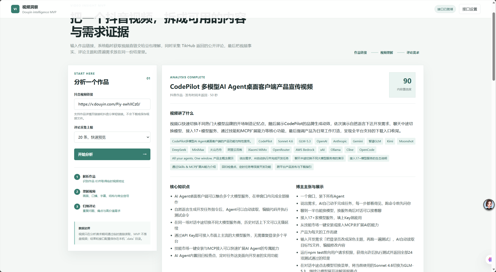
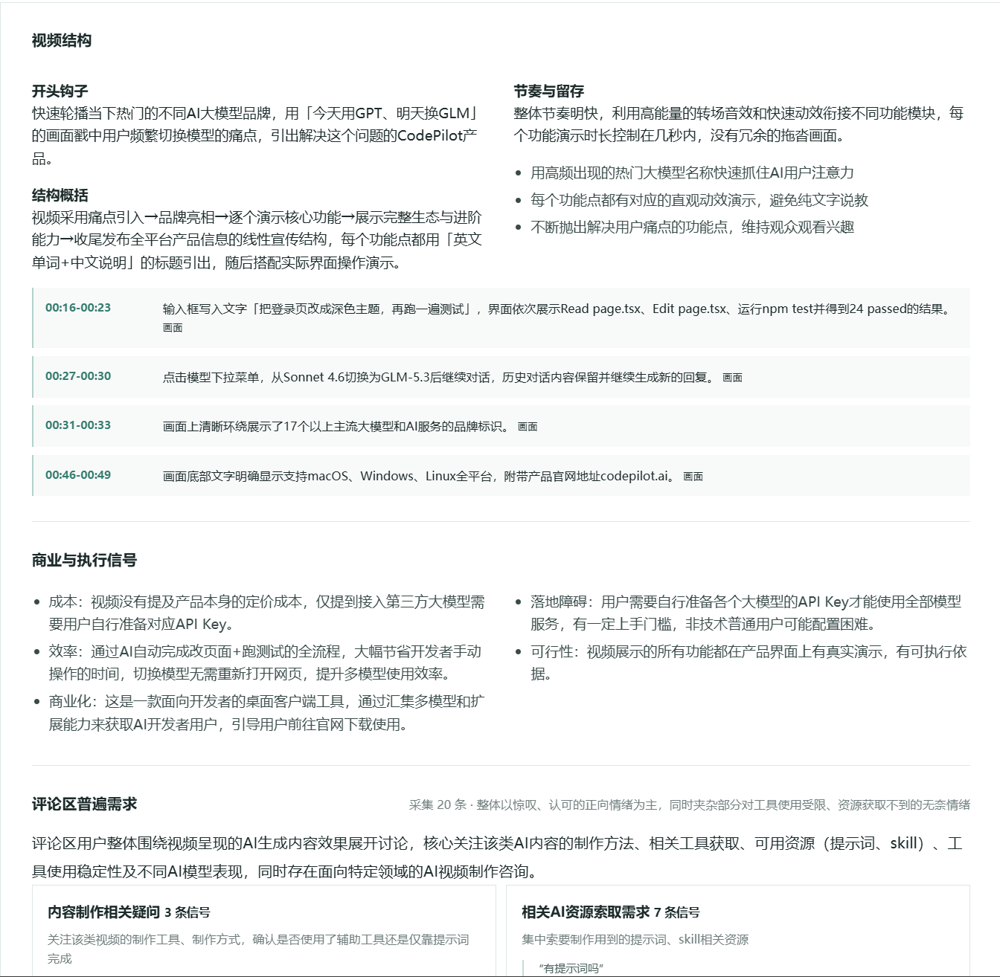
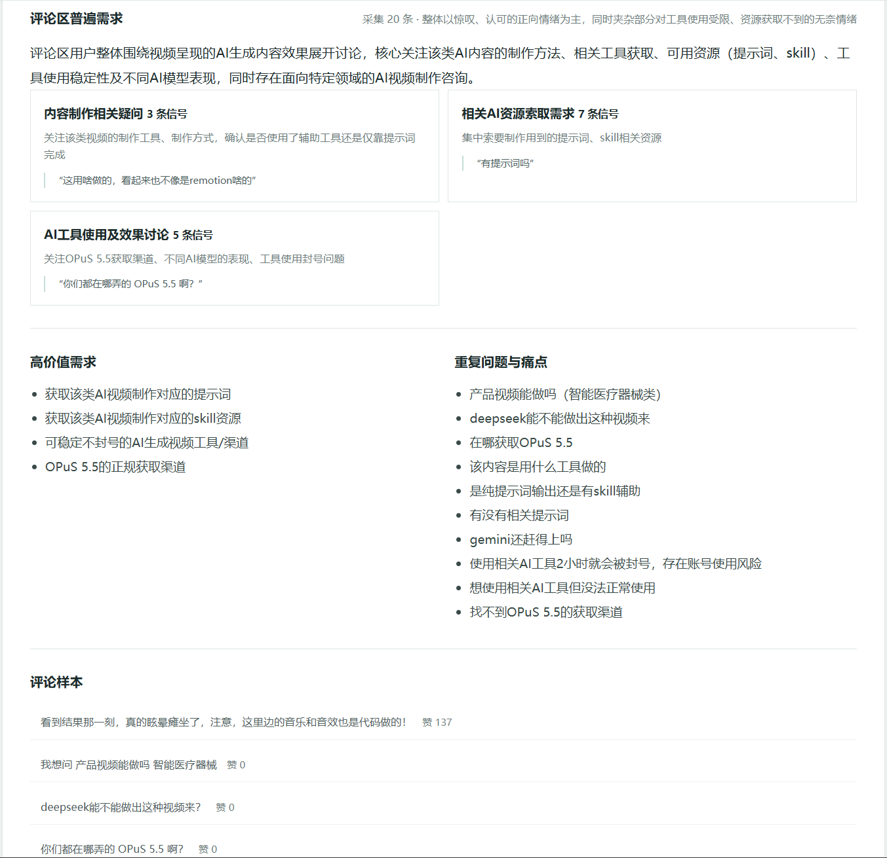

# 🎬 视频洞察工具

> 把一个抖音视频，拆成可用的内容，同时分析视频评论区，得到真实的用户需求。

输入作品链接，系统临时获取视频直链交给豆包理解，同时采集 TikHub 返回的公开评论，最后把 **视频事实、评论主题和普遍需求** 放在同一份结果里。



---

## ✨ 核心能力

| 步骤 | 做什么 | 产出 |
| :--- | :--- | :--- |
| **01 · 解析作品** | 识别作品 ID，取得临时视频地址 | 视频基本信息 |
| **02 · 理解视频** | 画面、口播、字幕、结构与商业信号 | 内容置信度 · 核心知识点 · 博主主张 |
| **03 · 归纳评论** | 重复问题、痛点与高价值需求 | 评论区需求清单 |

- 🧠 **大模型理解**：火山方舟模型逐帧理解视频内容
- 📊 **评论归因**：采集 TikHub 公开评论，聚合同类需求
- 🔒 **本地隐私**：仅监听 127.0.0.1，数据不出本机
- 🚀 **双击即用**：Windows 网页版，无需安装环境

## 📸 界面与产出展示

分析结果 · 视频结构拆解



分析结果 · 评论区需求洞察



## 🚀 快速开始

1. 双击 `VideoInsightMVP.exe`（Windows）。
2. 首次使用，点击右上角「接口设置」，填写 **火山方舟 API Key、模型 ID 与 TikHub API Key**。
3. 粘贴抖音作品链接，点击「开始分析」。

> ⚠️ 依赖运行时：`runtime/node.exe` 已作为 [Release v1.0.0](https://github.com/niwoxijifiy91-bot/video-insight-mvp/releases/tag/v1.0.0) 附件提供，clone 后请下载并放回 `runtime\` 目录。

## 🔒 数据边界

- 视频仅在分析请求期间通过临时直链读取，**MVP 不落盘视频文件**。
- API Key 与分析结果仅保存在当前 Windows 用户的本地应用数据目录：`%LOCALAPPDATA%\VideoInsightMVP\data`。
- 程序仅监听 `127.0.0.1`，不向局域网开放。

## 📦 项目结构

```
video-insight-mvp/
├── app/
│   ├── lib/          # 核心逻辑（成本核算、TikHub 客户端、视频洞察）
│   ├── public/       # 前端页面（app.js / index.html / styles.css）
│   └── server.mjs    # 本地服务
├── runtime/          # Node.js 运行时（Release 附件）
├── VideoInsightMVP.exe
└── README.md
```

## 🤝 一起完善

欢迎提交 **Issue** 与 **Pull Request**。请保持 MIT 许可证与数据隐私边界。

## 📄 许可证

[MIT](LICENSE) — 可商用、可修改、可再分发。
